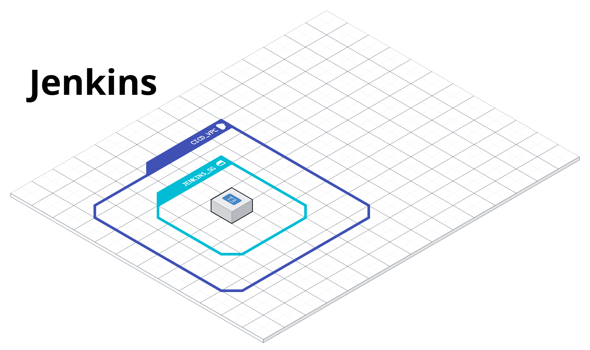
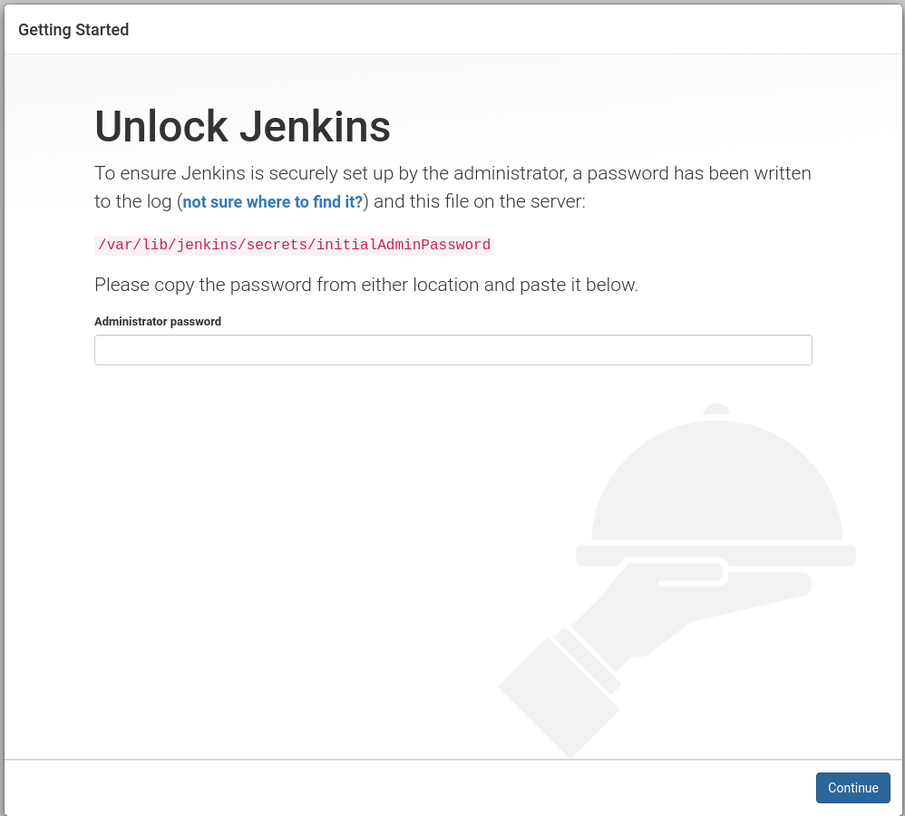
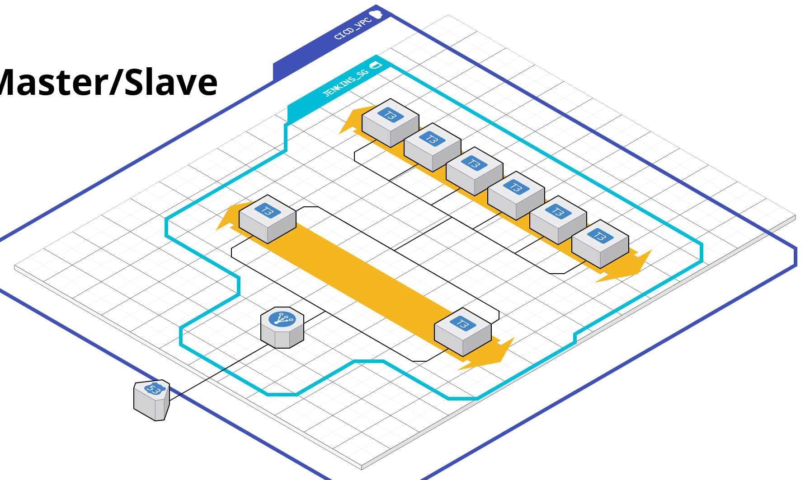

# Basic CI/CD Pipeline

EC2 based CI/CD Pipeline Terraform modules





## Dependencies

Install dependencies on your Linux desktop development environment 

* [AWS CLI](https://docs.aws.amazon.com/cli/latest/userguide/install-cliv2.html)
* [Terraform](https://www.terraform.io/)


## Setup

Configure yor AWS Cli tools with the client id and secret.
```bash
aws configure
```


## Deploy

To deploy jenkins server in AWS change directory to `examples/aws` folder. 
```bash
cd examples/aws/
```

Install terraform modules with the following
```bash
terraform init
```

Create a terraform plan which show you the resources that will be created
```bash
terraform plan
```

Apply the **plan** creating or updating the infrastructure in AWS.
```bash
terraform apply 
```




## Login/SSH

To remove the server and all associated resources you can do the following.  
```bash
terrafrom output
```


## Destroy

To remove the server and all associated resources you can do the following.  
```bash
terrafrom destroy
```
 
## Customizations
Edit the `examples/aws/variables.tfvars` file to customize aws configurations for the jenkins server.
 

# TODO
 * [ ] Route53/DNS
 * [ ] Backup/Restore
 * [ ] Load Balancing
 * [ ] Scaling Groups
 * [ ] Logging to cloud watch
 * [ ] Cloud watch alerts
 * [ ] Grafana for dashboards

 
## Issues

Traditionally, we scale by auto scaling EC2s. 
* Give the cluster a domain name
* Load balance between Jenkins masters
* Allow jenkins master auto scale slaves/agents with plugin


 
 
However it would cost less if we used containers for both the 
master and slaves/agents. Alternatively we could deploy jenkins in
Kubernetes which would keep resources at a minimum and scale 
up and down more naturally. Kubernetes also generates more metrics
about what is happening within it. However, Kubernets is more complex
and can scare folks new to containerization systems.


 
## Maintainers

**rangertaha**


