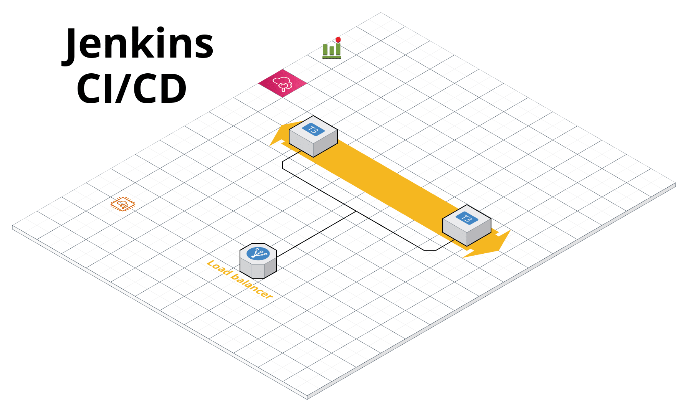

# CI/CD Pipeline 

CI/CD Pipeline Terraform module




## Resources

* EC2
* Load Balancer
* Cloud Watch Logging


## Dependencies

Install dependencies on your Linux desktop development environment 

* [AWS CLI](https://docs.aws.amazon.com/cli/latest/userguide/install-cliv2.html)
* [Terraform](https://www.terraform.io/)


## Setup

Configure yor AWS Cli tools with the client id and secret.
```bash
aws configure
```


## Deploy

To deploy jenkins server in AWS change directory to `examples/aws` folder. 
```bash
cd examples/aws/
```

Install terraform modules with the following
```bash
terraform init
```

Create a terraform plan which show you the resources that will be created
```bash
terraform plan
```

Apply the **plan** creating or updating the infrastructure in AWS.
```bash
terraform apply 
```


## Destroy

To remove the server and all associated resources you can do the following.  
```bash
terrafrom destroy
```
 
## Customizations
Edit the `examples/aws/variables.tf` file to customize aws configurations for the jenkins server.
 
 
 
## Maintainers

**rangertaha**


